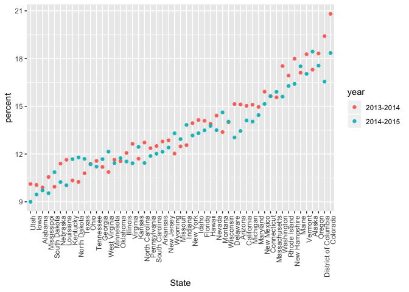
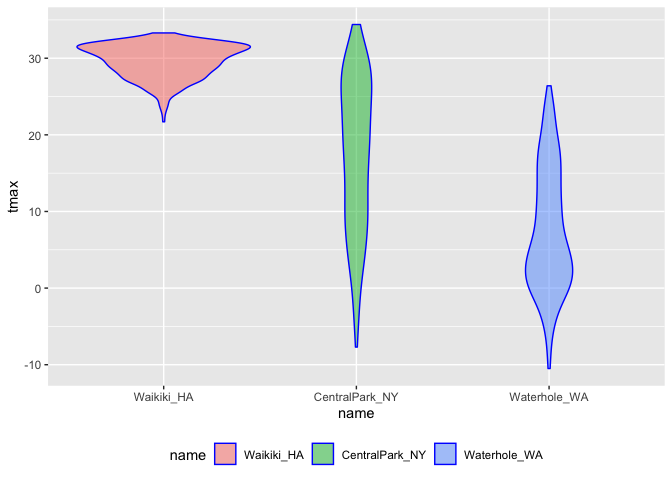
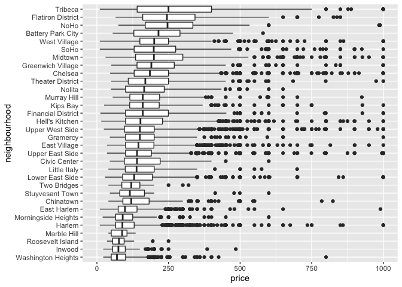

strings\_and\_factors
================
Xin He
10/10/2019

## string menapulation

``` r
string_vec = c("my", "name", "is", "xin")

str_detect(string_vec, "xin")
```

    ## [1] FALSE FALSE FALSE  TRUE

``` r
str_detect(string_vec, "jeff")
```

    ## [1] FALSE FALSE FALSE FALSE

``` r
str_replace(string_vec, "m", "M")
```

    ## [1] "My"   "naMe" "is"   "xin"

``` r
string_vec = c(
  "i think we all rule for participating",
  "i think i have been caught",
  "i think this will be quite fun actually",
  "it will be fun, i think"
  )

str_detect(string_vec, "^i think")
```

    ## [1]  TRUE  TRUE  TRUE FALSE

``` r
str_detect(string_vec, "i think$")
```

    ## [1] FALSE FALSE FALSE  TRUE

``` r
str_detect(string_vec, "i think")
```

    ## [1] TRUE TRUE TRUE TRUE

``` r
string_vec = c(
  "Y'all remember Pres. HW Bush?",
  "I saw a green bush",
  "BBQ and Bushwalking at Molonglo Gorge",
  "BUSH -- LIVE IN CONCERT!!"
  )

str_detect(string_vec,"[Bb]ush")
```

    ## [1]  TRUE  TRUE  TRUE FALSE

``` r
string_vec = c(
  '7th inning stretch',
  '1st half soon to begin. Texas won the toss.',
  'she is 5 feet 4 inches tall',
  '3AM - cant sleep :('
  )

str_detect(string_vec, "^[0-9][a-zA-Z]")
```

    ## [1]  TRUE  TRUE FALSE  TRUE

``` r
string_vec = c(
  'Its 7:11 in the evening',
  'want to go to 7-11?',
  'my flight is AA711',
  'NetBios: scanning ip 203.167.114.66'
  )

str_detect(string_vec, "7.11")
```

    ## [1]  TRUE  TRUE FALSE  TRUE

“.” can represent any charactor between 7 and 11

``` r
string_vec = c(
  'The CI is [2, 5]',
  ':-]',
  ':-[',
  'I found the answer on pages [6-7]'
  )

str_detect(string_vec, pattern = "\\[")
```

    ## [1]  TRUE FALSE  TRUE  TRUE

we must use two “\\”, one will lead to error.

## use string in practice

``` r
pulse_data = 
  haven::read_sas("./data/public_pulse_data.sas7bdat") %>%
  janitor::clean_names() %>%
  pivot_longer(
    bdi_score_bl:bdi_score_12m,
    names_to = "visit", 
    names_prefix = "bdi_score_",
    values_to = "bdi") %>%
  select(id, visit, everything()) %>%
  mutate(
    visit = str_replace(visit, "bl", "00m"),
    visit = fct_relevel(visit, str_c(c("00", "01", "06", "12"), "m"))) %>%
  arrange(id, visit)

print(pulse_data, n = 12)
```

    ## # A tibble: 4,348 x 5
    ##       id visit   age sex     bdi
    ##    <dbl> <fct> <dbl> <chr> <dbl>
    ##  1 10003 00m    48.0 male      7
    ##  2 10003 01m    48.0 male      1
    ##  3 10003 06m    48.0 male      2
    ##  4 10003 12m    48.0 male      0
    ##  5 10015 00m    72.5 male      6
    ##  6 10015 01m    72.5 male     NA
    ##  7 10015 06m    72.5 male     NA
    ##  8 10015 12m    72.5 male     NA
    ##  9 10022 00m    58.5 male     14
    ## 10 10022 01m    58.5 male      3
    ## 11 10022 06m    58.5 male      8
    ## 12 10022 12m    58.5 male     NA
    ## # … with 4,336 more rows

``` r
nsduh_url = "http://samhda.s3-us-gov-west-1.amazonaws.com/s3fs-public/field-uploads/2k15StateFiles/NSDUHsaeShortTermCHG2015.htm"

table_marj = 
  read_html(nsduh_url) %>% 
  html_nodes(css = "table") %>% 
  .[[1]] %>%
  html_table() %>%
  slice(-1) %>%
  as_tibble()
```

``` r
data_marj = 
  table_marj %>%
  select(-contains("P Value")) %>%
  pivot_longer(
    -State,
    names_to = "age_year", 
    values_to = "percent") %>%
  separate(age_year, into = c("age", "year"), sep = "\\(") %>%
  mutate(
    year = str_replace(year, "\\)", ""),
    percent = str_replace(percent, "[a-c]$", ""),
    percent = as.numeric(percent)) %>%
  filter(!(State %in% c("Total U.S.", "Northeast", "Midwest", "South", "West")))
```

``` r
data_marj %>%
  filter(age == "12-17") %>% 
  mutate(State = fct_reorder(State, percent)) %>% 
  ggplot(aes(x = State, y = percent, color = year)) + 
    geom_point() + 
    theme(axis.text.x = element_text(angle = 90, hjust = 1))
```

<!-- -->

## Factors

``` r
weather_df = 
  rnoaa::meteo_pull_monitors(
    c("USW00094728", "USC00519397", "USS0023B17S"),
    var = c("PRCP", "TMIN", "TMAX"), 
    date_min = "2017-01-01",
    date_max = "2017-12-31") %>%
  mutate(
    name = recode(id, USW00094728 = "CentralPark_NY", 
                      USC00519397 = "Waikiki_HA",
                      USS0023B17S = "Waterhole_WA"),
    tmin = tmin / 10,
    tmax = tmax / 10) %>%
  select(name, id, everything())
```

    ## Registered S3 method overwritten by 'crul':
    ##   method                 from
    ##   as.character.form_file httr

    ## Registered S3 method overwritten by 'hoardr':
    ##   method           from
    ##   print.cache_info httr

    ## file path:          /Users/hexin/Library/Caches/rnoaa/ghcnd/USW00094728.dly

    ## file last updated:  2019-09-26 10:26:24

    ## file min/max dates: 1869-01-01 / 2019-09-30

    ## file path:          /Users/hexin/Library/Caches/rnoaa/ghcnd/USC00519397.dly

    ## file last updated:  2019-09-26 10:26:33

    ## file min/max dates: 1965-01-01 / 2019-09-30

    ## file path:          /Users/hexin/Library/Caches/rnoaa/ghcnd/USS0023B17S.dly

    ## file last updated:  2019-09-26 10:26:36

    ## file min/max dates: 1999-09-01 / 2019-09-30

``` r
weather_df
```

    ## # A tibble: 1,095 x 6
    ##    name           id          date        prcp  tmax  tmin
    ##    <chr>          <chr>       <date>     <dbl> <dbl> <dbl>
    ##  1 CentralPark_NY USW00094728 2017-01-01     0   8.9   4.4
    ##  2 CentralPark_NY USW00094728 2017-01-02    53   5     2.8
    ##  3 CentralPark_NY USW00094728 2017-01-03   147   6.1   3.9
    ##  4 CentralPark_NY USW00094728 2017-01-04     0  11.1   1.1
    ##  5 CentralPark_NY USW00094728 2017-01-05     0   1.1  -2.7
    ##  6 CentralPark_NY USW00094728 2017-01-06    13   0.6  -3.8
    ##  7 CentralPark_NY USW00094728 2017-01-07    81  -3.2  -6.6
    ##  8 CentralPark_NY USW00094728 2017-01-08     0  -3.8  -8.8
    ##  9 CentralPark_NY USW00094728 2017-01-09     0  -4.9  -9.9
    ## 10 CentralPark_NY USW00094728 2017-01-10     0   7.8  -6  
    ## # … with 1,085 more rows

**relevel**

``` r
weather_df %>%
  mutate(name = fct_relevel(name, c("Waikiki_HA", "CentralPark_NY", "Waterhole_WA"))) %>% 
  ggplot(aes(x = name, y = tmax)) + 
  geom_violin(aes(fill = name), color = "blue", alpha = .5) + 
  theme(legend.position = "bottom")
```

    ## Warning: Removed 3 rows containing non-finite values (stat_ydensity).

<!-- -->

``` r
weather_df %>%
  mutate(name = forcats::fct_relevel(name, c("Waterhole_WA"))) %>% 
  ggplot(aes(x = name, y = tmax)) + 
  geom_violin(aes(fill = name), color = "blue", alpha = .5) + 
  theme(legend.position = "bottom")
```

    ## Warning: Removed 3 rows containing non-finite values (stat_ydensity).

<!-- -->

**reorder**

``` r
weather_df %>%
  mutate(name = forcats::fct_reorder(name, tmax)) %>% 
  ggplot(aes(x = name, y = tmax)) + 
  geom_violin(aes(fill = name), color = "blue", alpha = .5) + 
  theme(legend.position = "bottom")
```

    ## Warning: Removed 3 rows containing non-finite values (stat_ydensity).

<!-- -->
order with tmax (small to big)

``` r
data("nyc_airbnb")

nyc_airbnb %>%
  filter(neighbourhood_group == "Manhattan") %>% 
  mutate(
    neighbourhood = fct_reorder(neighbourhood, price, na.rm = TRUE)) %>% 
  ggplot(aes(x = neighbourhood, y = price)) +
  geom_boxplot() +
  coord_flip() + 
  ylim(0, 1000)
```

    ## Warning: Removed 109 rows containing non-finite values (stat_boxplot).

<!-- -->
coord\_flip() reverse x and y.

what about factors and linear models?

``` r
weather_df %>%
  lm(tmax ~ name, data = .)
```

    ## 
    ## Call:
    ## lm(formula = tmax ~ name, data = .)
    ## 
    ## Coefficients:
    ##      (Intercept)    nameWaikiki_HA  nameWaterhole_WA  
    ##           17.366            12.291            -9.884

``` r
weather_df %>%
  mutate(name = forcats::fct_relevel(name, c("Waikiki_HA", "CentralPark_NY", "Waterhole_WA"))) %>% 
  lm(tmax ~ name, data = .)
```

    ## 
    ## Call:
    ## lm(formula = tmax ~ name, data = .)
    ## 
    ## Coefficients:
    ##        (Intercept)  nameCentralPark_NY    nameWaterhole_WA  
    ##              29.66              -12.29              -22.18
